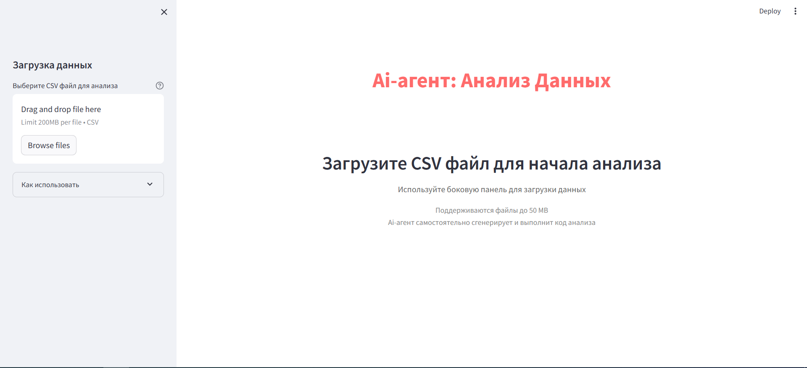
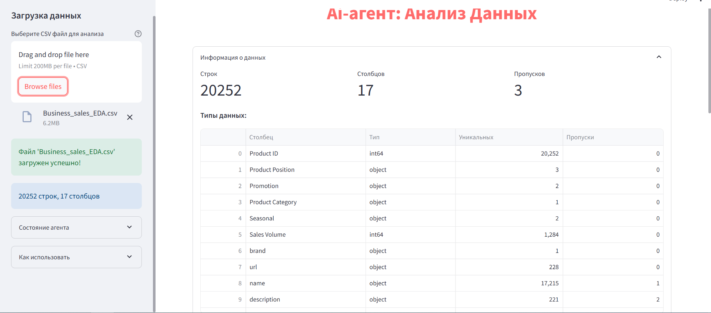
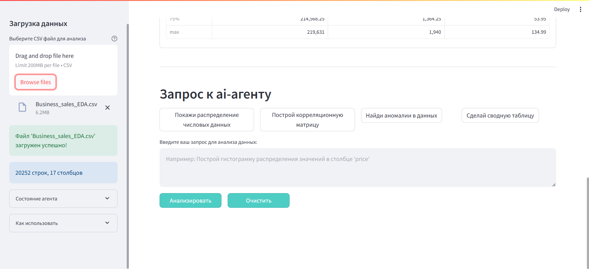
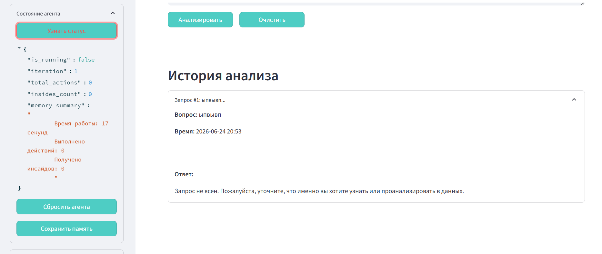

# Задание номер 3. Аи-агент.

Проект представляет собой Аи-агента, который может дать вам информацию про csv файл, который вы можете загрузить

## Инструкция.

Чтобы запустить сам проект вам понадобится api ключ openrouter. Создайте файл .env и заполните его следующим образом:

OPENROUTER_API_KEY=sk-or-v1-ВАШ_АПИ_КЛЮЧ (ну или прям всё копируйте, тогда левую часть уберите)
OPENROUTER_BASE_URL=https://openrouter.ai/api/v1
LLM_MODEL=Модель_ЛЛМ

В проекте используется streamlit, благодаря которому вы увидете сам сайт с проектом. С левой стороны будет видна кнопка загрузки файлов, там можете выбрать нужный файл. Ниже этой кнопки есть подсказка "Как использовать", в которой написано, что можете сделать.

После добавления файла появится больше информации про датасет. Я сделал так, чтобы немного информации про него было сразу видно.

Запросы вы можете добавить, если проскролите вниз. Есть несколько быстрых запросов, чтобы вы выбрали направление того, что вы хотите узнать от агента. Но лучше добавить информацию, про что конкретно вы хотите узнать.

Например если написать что-то непонятное, должно вывести что-то такое. Ещё ответ на запрос будет сохраняться в вашей папке файлом agent_memory.json, может пригодится для чего-нибудь?

## Структура проекта.

В начале сделал конфигурацию и настройки, инструменты анализа данных. Это файлы config.py и data_tools.py
Потом начал делать самго агента. До этого я делал LLM с шаблоном ответа, но всё же смог продвинуться дальше и получились файлы: agent_memory.py, llm_agent.py.
Ну и под конец сделал сам вид проекта: utils.py и app.py.

Я не знаю, надо было ли деплоить проект, поэтому я просто показал на скринах как он выглядит, да и в принципе, если вы скачаете проект, то только создать .env файл надо будет и свой апи ключ, поэтому надеюсь нормально будет.